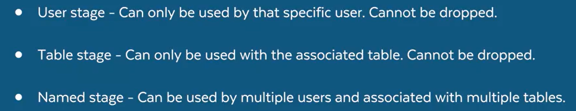

# Staging

Staging in Snowflake is essential for managing data loading and unloading operations efficiently. They are crucial for both internal and external data management, ensuring data security, performance, and integration with queries.

* It acts as a buffer between external files and database tables, allowing for secure and flexible data processing. 
* Stages help decouple the movement of raw files from their final destination, providing a clean and error-resilient data pipeline.

## Internal Stage
Store data files internally within Snowflake. For detailed information, use this link [Internal Storage for local files](https://docs.snowflake.com/en/user-guide/data-load-local-file-system-create-stage).

By default, each user and table in Snowflake is automatically allocated an internal stage for staging data files to be loaded. In addition, you can create named internal stages.

File staging information is required during both steps in the data loading process:

You must specify an internal stage in the PUT command when uploading files to Snowflake.

You must specify the same stage in the COPY INTO \<_table_\> command when loading data into a table from the staged files.

Consider the best type of stage for specific data files. Each option provides benefits and potential drawbacks.

Snowflake supports the following types of internal stages:
* User:
    * User stages are referenced using `@~;` e.g. use `LIST @~` to list the files in a user stage.
    * Unlike named stages, user stages cannot be altered or dropped.
    * User stages do not support setting file format options. Instead, you must specify file format and copy options as part of the COPY INTO  \<_table_\> command.

     Not appropriate if: 
    * Multiple users require access to the files.
    * The current user does not have INSERT privileges on the tables the data will be loaded into.

* Table:
    * You might use a table stage if you only need to copy files into a single table, but want to make the files accessible to multiple users.

    * A table stage has the same name as the table. For example, a table named mytable has a stage referenced as @%mytable.

    * A table stage is an implicit stage tied to a table object. It’s not a separate database object. As a result, a table stage has no grantable privileges of its own.

    * To stage files on a table stage, list the files, query the files, or drop them, you must be the table owner (have the role with the OWNERSHIP privilege on the table).

    * Unlike a named stage, you can’t alter or drop a table stage.

    * Table stages don’t support transforming data while loading it (using a query as the source for the COPY command).

     Not appropriate if: 
    * You need to copy file data into multiple tables.

* Named:
  * Database objects that provide the **greatest degree of flexibility for data loading**
  *  Users with the appropriate privileges on the stage can load data into any table.
  * Because the stage is a database object, the security/access rules that apply to all objects apply. The privileges to use a stage can be granted or revoked from roles. In addition, ownership of the stage can be transferred to another role.
  * Named stages are optional but recommended when you plan regular data loads that could involve multiple users and/or tables. 

## External Stage

References data files stored in a location outside of Snowflake. Currently, the following cloud storage services are supported:
* Amazon S3 buckets
* Google Cloud Storage buckets
* Microsoft Azure containers

The storage location can be either private/protected or public.

You cannot access data held in archival cloud storage classes that requires restoration before it can be retrieved. These archival storage classes include, for example, the Amazon S3 Glacier Flexible Retrieval or Glacier Deep Archive storage class, or Microsoft Azure Archive Storage.