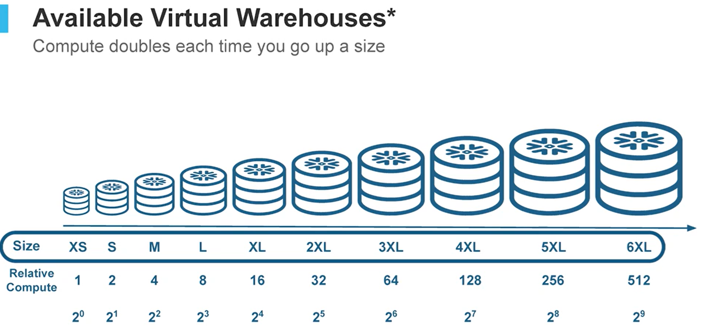

# Virtual Warehouse

The Virtual Warehouses contain all the compute resources that can be used for our tasks, think of them as the CPU needed to execute specific workloads.

As of today there are 4 types of Warehouses:

1. Standard (Gen 2):
    * Bring new hardware and software optimizations for most workloads that require more performance.
2. Standard (Gen 2):
    * Snowflake's original, industry-leading standard virtual warehouses.
3. Snowpark-optimized:
    * Offer a larger memoru and cache. These are often used for memory intensive operations.
4. Interactive:
    * Optimized for low-latency, interactive workloads. Suitable for IoT.


## Create Virtual Warehouses
You can create virtual warehouses by using the UI or using the SQL code below

```sql
---> Create a Virtual Warehouse
CREATE WAREHOUSE WH_Edwin;

---> Visualize all warehouses available
SHOW WAREHOUSES;

---> Switch to an specific warehouse
USE WAREHOUSE WH_Edwin;

---> Set warehouse size to xsmall
ALTER WAREHOUSE warehouse_dash SET warehouse_size=XSMALL;

---> Drop warehouse
DROP WAREHOUSE WH_Edwin;

---> Set the auto_suspend and auto_resume parameters
ALTER WAREHOUSE warehouse_dash SET AUTO_SUSPEND = 180 AUTO_RESUME = FALSE;

```

## Scaling


### Vertical scaling 

This refers to increasing the compute power for our workloads, this impacts cost and efficiency.

The image below displays the available Virtual Warehouse sizes.



### Horizontal scaling

This is used when we have concurrent users and/or tasks that can be used in parallel to execute ourtasks. 

```sql
---> Create a multi-cluster warehouse (max clusters = 3)
CREATE WAREHOUSE WH_Edwin MAX_CLUSTER_COUNT = 3;

---> Suspend/Stop a cluster
ALTER WAREHOUSE WH_Edwin SUSPEND;
```

<span style='color:red'>**Note**:</span> Each time a user submits a task, Snowflake automatically allocates the compute resources required to execute it. However, when multiple tasks run simultaneously, Snowflake is limited to the resources defined in the Virtual Warehouse. If those resources are insufficient, new tasks are forced to wait in a queue. By scaling horizontally, we can increase the number of available compute clusters, enabling true parallel execution and eliminating unnecessary delays.


