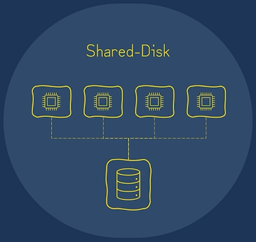
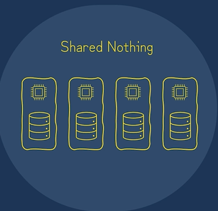

# Traditional Architectures

## Shared-Disk

All data is accesible from all clusters nodes, any machine can read or write any portion of the data.

### Advantages

* Relatively simple to manage.
* Single source of thruth.

### Disadvantages

* Single point of failure.
* Bandwith and network latency.
* Limited scalability.

## Shared Nothing

The nodes in this architecture do not share any hardware.  
Storage and compute are located on separate machines that are networked together.  
The nodes in the cluster contain a subset of the data locally, instead of sharing one central data repository. 